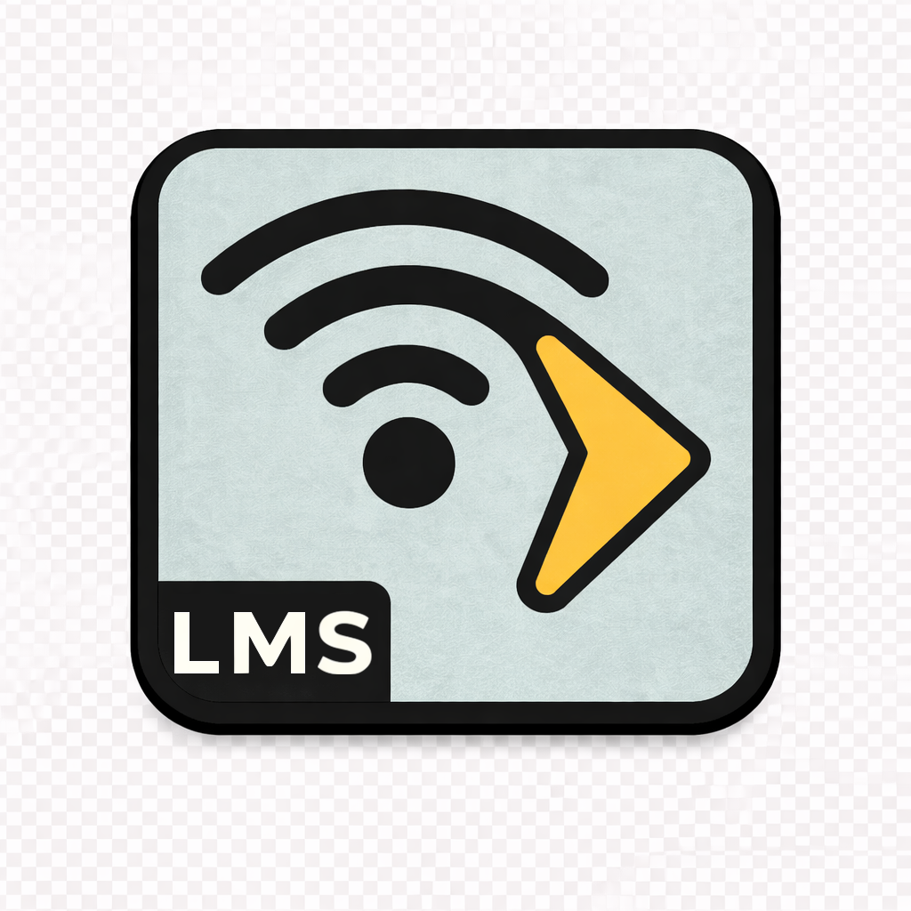

<div align="center">


<h3>Plugin to show original Plex track metadata in LMS when using Squeeze Plex Hub</h3>

<p>
<a href="https://codecov.io/gh/onmomo/lms-squeeze-plex-hub" target="_blank" rel="noopener noreferrer"></a>
<a href="https://hub.docker.com/r/onmomo/squeeze-plex-hub/tags" target="_blank" rel="noopener noreferrer"></a>
<a href="https://github.com/sponsors/onmomo" target="_blank" rel="noopener noreferrer"></a>
</p>

<p>
<a href="https://github.com/onmomo/squeeze-plex-hub" target="_blank" rel="noopener noreferrer">🔗 Squeeze Plex Hub</a> &bull;
<a href="https://lyrion.org" target="_blank" rel="noopener noreferrer">🔊 Lyrion</a> &bull;
<a href="https://www.plex.tv/plexamp" target="_blank" rel="noopener noreferrer">⏯️ Plexamp</a> &bull;
<a href="https://www.cmos.blog/?p=1014" target="_blank" rel="noopener noreferrer">🌐 Project Page</a>
</p>

</div>

# LMS Squeeze Plex Hub Plugin

**Squeeze Plex Hub Plugin** is a plugin for **Lyrion Music Server (LMS)** that enriches playback with **Plex Media Server (PMS) metadata** when tracks are loaded via the **Squeeze Plex Hub** application.

When audio is streamed into LMS through Squeeze Plex Hub, this plugin bridges the metadata gap by fetching and displaying the original Plex song information (title, artist, album, artwork, etc.) inside LMS and on connected players.

While optional, this plugin is strongly recommended when using the [Squeeze Plex Hub](https://github.com/onmomo/squeeze-plex-hub) project to unlock the best overall playback and metadata experience in LMS.

---

## Features

- Displays **Plex PMS metadata** in LMS
- Automatically detects tracks loaded via **Squeeze Plex Hub**
- Shows correct **title, artist, album, and artwork**

---

## Requirements

- **Lyrion Music Server (LMS)**
- **Squeeze Plex Hub** application
- **Plex Media Server** reachable from Squeeze Plex Hub

---

## Installation

### Manual Installation (Recommended for Development)

1. Clone this repository
2. Ensure the plugin directory is named exactly:
3. Restart LMS after any change
   > LMS does **not** hot-reload plugins

---

## Local Development 🛠️

### Unit Testing
From repo root:
```bash
cpanm --installdeps --notest .
prove -lr t
```

### macOS (LMS Package)

Install the Lyrion Music Server DMG for macOS, then symlink the plugin into LMS:

```bash
mkdir -p "/Users/$USER/Library/Application Support/Squeezebox/Plugins/SqueezePlexHub"
ln -sv "$(pwd)/SqueezePlexHub/"* "/Users/$USER/Library/Application Support/Squeezebox/Plugins/SqueezePlexHub"
```

Restart LMS after linking.

### Docker (Development & Testing) 🐳

You can run LMS in Docker and mount the plugin directly:

```bash
docker run --rm -it \
  -e TZ=Europe/Zurich \
  -v $PWD/config:/config:rw \
  -v $PWD/SqueezePlexHub:/lms/Plugins/SqueezePlexHub:ro \
  -v $PWD/music:/music:ro \
  -v $PWD/playlist:/playlist:ro \
  -v /etc/localtime:/etc/localtime:ro \
  -p 9000:9000/tcp \
  -p 9090:9090/tcp \
  -p 3483:3483/tcp \
  -p 3483:3483/udp \
  lmscommunity/lyrionmusicserver
```

⚠️ Note:
I could LMS not to work properly with Docker Desktop (macOS) for development.
Native Linux Docker is recommended for best results.

## How It Works 🧠

Squeeze Plex Hub loads tracks into LMS playlist
The plugin detects those tracks
Metadata is fetched from Plex Media Server
LMS is updated in real-time with enriched metadata

## Contributing 🤝

Pull requests, bug reports, and feature ideas are welcome.
If you enjoy extending LMS, Plex, or using legacy Squeezebox hardware with Plex — contributions or sponsorships are appreciated.

👉 [GitHub Sponsors](https://github.com/sponsors/onmomo)

## License

This project is licensed under the MIT License.

## Disclaimer

**LMS Squeeze Plex Hub Plugin** is an independent, open source project and is **not affiliated with, endorsed by, or officially supported by Plex, Plexamp, Logitech, or Slim Devices**.  
All product names and trademarks are the property of their respective owners.
